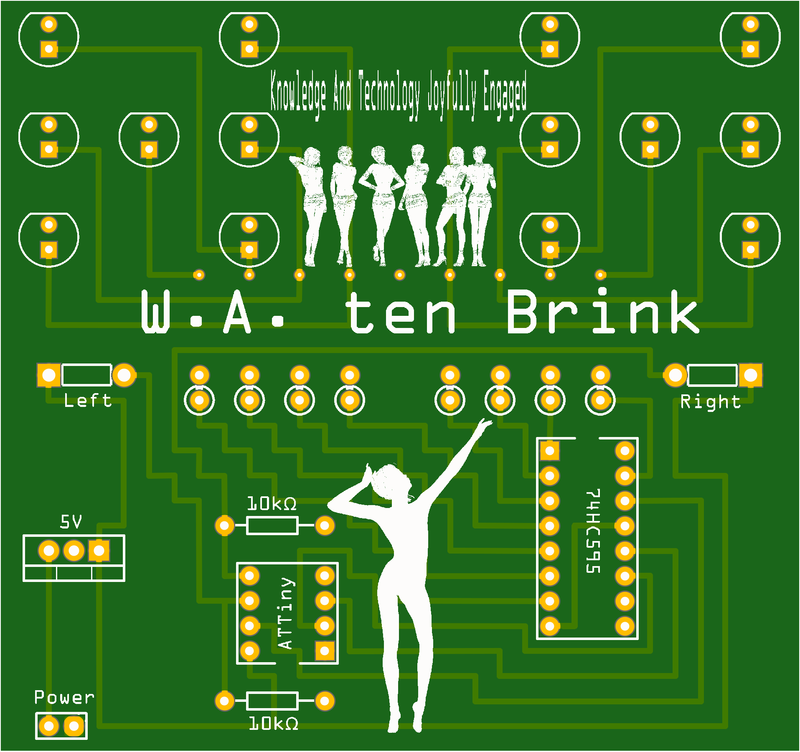
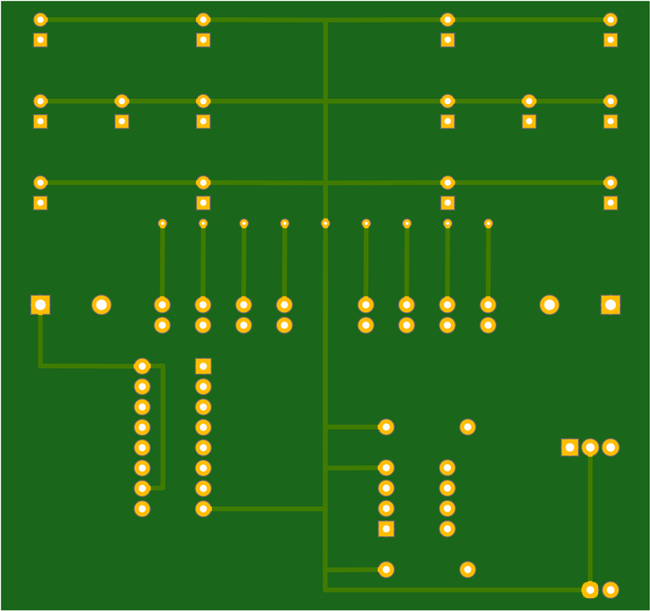

# Two dice

## About This Project

## Renderings

### Top

### Bottom

## BOM

|Count|Component|Details|Datasheet|
|-|-|-|-|
|2x|R11 / R9|Res Wirewound 10K Ohm 5% 5W 100ppm/°C to 180ppm/°C Conformal AXL Thru-Hole Ammo Pack|[Link](http://datasheet.octopart.com/AC05000001002JAC00-Vishay-datasheet-68299458.pdf)|
|14x|LED3 / LED4 / LED7 / LED8 / LED9 / LED1 / LED10 / LED11 / LED12 / LED13 / LED14 / LED15 / LED16 / LED2|LED, Green, T-1 3/4 (5mm), 522 nm, 3.4 V, 30 mA, 10 cd|[Link](http://datasheet.octopart.com/151053GS03000-W%C3%BCrth-Elektronik-datasheet-41196475.pdf)|
|8x|R2 / R3 / R4 / R5 / R6 / R7 / R8 / R1|SFR25 Series Ø 2.5 x 6.5 mm 0.4 W 220 Ohm ±1 % ±100 ppm/K Metal Film Resistor|[Link](http://datasheet.octopart.com/SFR2500002200FR500-Vishay-datasheet-7601024.pdf)|

---

This project is managed and available on

You can view it [here](https://aisler.net/p/VJCQGTXT). Start your own Powerful Prototype on [here](https://aisler.net).
